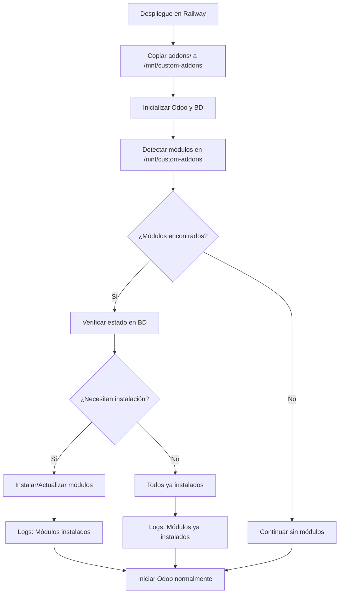

# 📦 Módulos Personalizados en Railway - Guía Completa

## 🎯 Problema Solucionado

**ANTES**: Los módulos personalizados se copiaban al contenedor pero **no se instalaban automáticamente** en Railway.

**AHORA**: Los módulos personalizados se detectan, verifican e instalan automáticamente en cada despliegue.

## ✅ Funcionamiento Automático

### 1. **Detección Automática**
El sistema busca automáticamente módulos en `/mnt/custom-addons/` que tengan:
- Directorio con `__manifest__.py` válido
- Estructura de módulo de Odoo correcta

### 2. **Verificación de Estado**
Para cada módulo encontrado, verifica:
- Si ya está instalado en la base de datos
- Si necesita actualización
- Si es un módulo nuevo que debe instalarse

### 3. **Instalación Inteligente**
- **Primera vez**: Instala todos los módulos encontrados
- **Despliegues posteriores**: Solo instala módulos nuevos o actualiza los existentes
- **Logs detallados**: Muestra el progreso de cada operación

## 📦 Módulos Incluidos en este Proyecto

Los siguientes módulos están en el directorio `/addons/` y se instalarán automáticamente:

### Módulos Educativos:
- **`education_core`**: Sistema educativo principal
- **`education_attendances`**: Control de asistencias estudiantiles
- **`education_theme`**: Tema personalizado para instituciones educativas

### Módulos de Interfaz (MuK):
- **`muk_web_theme`**: Tema moderno para Odoo
- **`muk_web_appsbar`**: Barra de aplicaciones mejorada
- **`muk_web_chatter`**: Chat mejorado
- **`muk_web_colors`**: Sistema de colores
- **`muk_web_dialog`**: Diálogos mejorados

### Módulos de RR.HH.:
- **`om_hr_payroll`**: Sistema de nóminas

### Herramientas:
- **`query_deluxe`**: Herramientas de consulta avanzada

## 🔍 Cómo Verificar que los Módulos Están Instalados

### 1. **Verificación Automática (Recomendado)**
```bash
railway run /usr/local/bin/check-modules-railway.sh
```

**Resultado esperado:**
```
=== Verificador de Módulos Personalizados en Railway ===
✓ Conexión exitosa
✓ Directorio existe
  Módulos encontrados: 10
✓ /mnt/custom-addons está incluido en addons_path
✓ Base de datos inicializada
  Estado de módulos personalizados:
    ✓ education_core: INSTALADO
    ✓ education_attendances: INSTALADO
    ✓ muk_web_theme: INSTALADO
    ✓ om_hr_payroll: INSTALADO
🎉 RESULTADO: Todos los módulos personalizados están instalados correctamente
```

### 2. **Verificación en los Logs de Railway**
```bash
railway logs --follow
```

Busca estas líneas en los logs:
```
Verificando módulos personalizados disponibles...
Módulos personalizados encontrados en /mnt/custom-addons:
Módulo personalizado encontrado: education_core
Estado del módulo education_core: installed
Todos los módulos personalizados ya están instalados
```

### 3. **Verificación en la Interfaz Web de Odoo**
1. Accede a tu aplicación de Railway
2. Ve a **Aplicaciones** → **Actualizaciones**
3. Busca los módulos personalizados en la lista
4. Deberían aparecer como "Instalado"

## 🛠️ Solución de Problemas

### ❌ Problema: "No se encontraron módulos personalizados"

**Diagnóstico:**
```bash
railway run /usr/local/bin/verify-custom-modules.sh
```

**Posibles causas:**
- Los módulos no se copiaron correctamente al contenedor
- Faltan archivos `__manifest__.py`
- Permisos incorrectos

**Solución:**
```bash
# Verificar estructura de archivos
railway run ls -la /mnt/custom-addons/

# Hacer redeploy para copiar archivos correctamente
railway up --detach
```

### ❌ Problema: "Módulos no se instalan automáticamente"

**Diagnóstico:**
```bash
railway run /usr/local/bin/check-modules-railway.sh
```

**Solución manual:**
```bash
# Instalar módulos manualmente
railway run /usr/local/bin/install-custom-modules.sh
```

### ❌ Problema: "Error durante la instalación de módulos"

**Ver logs detallados:**
```bash
railway logs --follow
```

**Soluciones:**
1. **Error de dependencias**: Verifica que las dependencias estén en `__manifest__.py`
2. **Error de permisos**: Ejecuta el script de corrección:
   ```bash
   railway run /usr/local/bin/fix-permissions.sh
   ```
3. **Error de base de datos**: Verifica conexión:
   ```bash
   railway run /usr/local/bin/debug-connection.sh
   ```

## 🚀 Instalación Manual de Módulos (Si es necesario)

### 1. **Instalar todos los módulos personalizados**
```bash
railway run /usr/local/bin/install-custom-modules.sh
```

### 2. **Instalar un módulo específico**
```bash
railway run python3 /usr/bin/odoo -c /etc/odoo/odoo.conf -d [nombre_db] -i education_core --stop-after-init
```

### 3. **Actualizar módulos existentes**
```bash
railway run python3 /usr/bin/odoo -c /etc/odoo/odoo.conf -d [nombre_db] -u all --stop-after-init
```

## 📋 Checklist de Verificación

- [ ] Los módulos están en el directorio `/addons/` en tu repositorio
- [ ] Cada módulo tiene un archivo `__manifest__.py` válido
- [ ] El despliegue en Railway fue exitoso
- [ ] Los logs muestran "Módulos personalizados instalados exitosamente"
- [ ] La verificación con `check-modules-railway.sh` es exitosa
- [ ] Los módulos aparecen como instalados en la interfaz de Odoo

## 🔄 Flujo Automático en Railway



## 💡 Consejos Importantes

1. **Primera vez**: El proceso puede tomar 10-15 minutos debido a la instalación de módulos
2. **Despliegues posteriores**: Son más rápidos (2-5 minutos) porque solo verifica el estado
3. **Logs**: Siempre revisa los logs para confirmar la instalación exitosa
4. **Verificación**: Usa `check-modules-railway.sh` después de cada despliegue importante
5. **Desarrollo**: Para agregar nuevos módulos, colócalos en `/addons/` y haz redeploy

## 🆘 Contacto para Soporte

Si los módulos siguen sin instalarse después de seguir esta guía:

1. Ejecuta todos los comandos de verificación y guarda la salida
2. Revisa los logs completos de Railway
3. Verifica que las variables de entorno estén configuradas correctamente
4. Proporciona la información recopilada para obtener ayuda específica

---

**¡Los módulos personalizados ahora se instalan automáticamente en Railway!** 🎉
